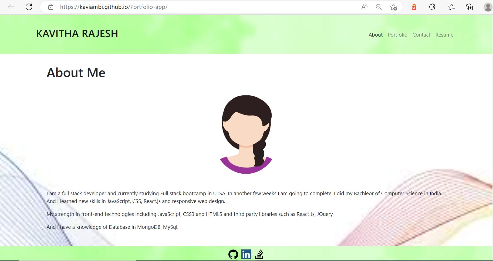
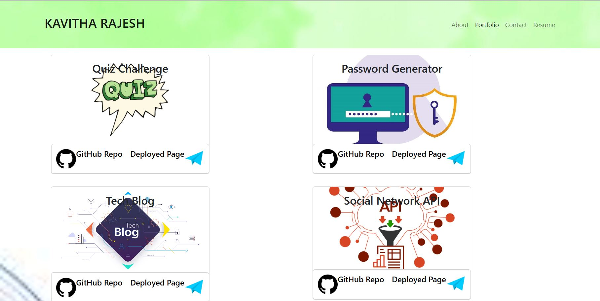
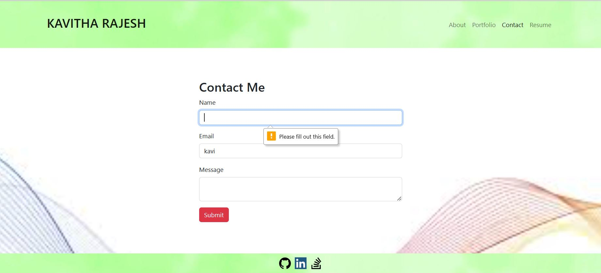
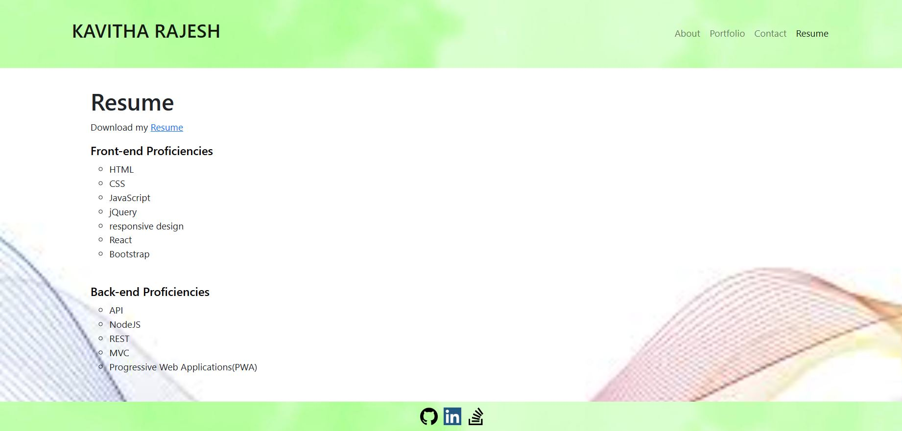

## React Portfolio 

I have created a Portfolio using React skills. This is a single page applications and deployed in gitHub Pages. 

## User Story

```md
AS AN employer looking for candidates with experience building single-page applications
I WANT to view a potential employee's deployed React portfolio of work samples
SO THAT I can assess whether they're a good candidate for an open position
```
## Screenshots 
shows the application appearance and functionality.








URL of the deployed application - https://kaviambi.github.io/Portfolio-app/

GitHub Repo - https://github.com/Kaviambi/Portfolio-app.git
